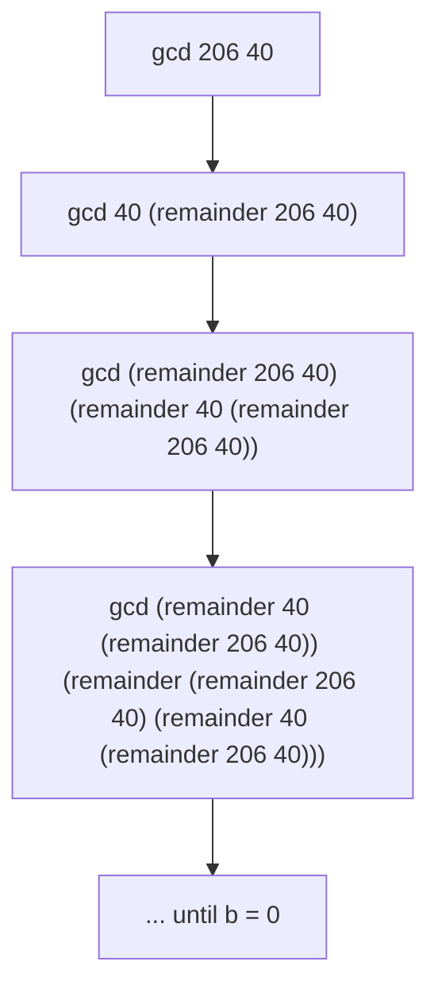

```mermaid
graph TD
  G0["gcd 206 40"]
  G1["gcd 40 (remainder 206 40)"]
  G2["gcd (remainder 206 40) (remainder 40 (remainder 206 40))"]
  G3["gcd (remainder 40 (remainder 206 40)) (remainder (remainder 206 40) (remainder 40 (remainder 206 40)))"]
  G4["... until b = 0"]

  G0 --> G1
  G1 --> G2
  G2 --> G3
  G3 --> G4
```

---

結論まとめ

評価方法	プロセスの特性	remainder の実行回数
適用順序評価	各引数は1度だけ評価されて渡される	4回
正規順序評価	同じ remainder 式が何度も展開される	8回（重複含む）

