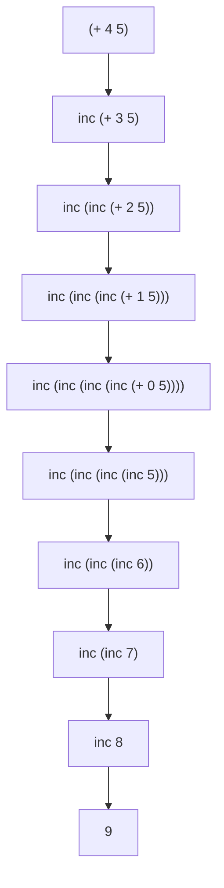
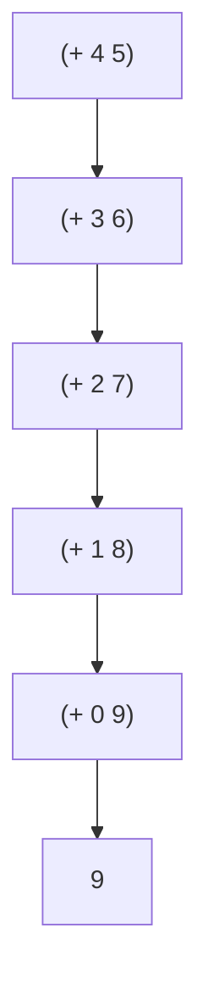

- 再帰的プロセス

```mermaid
graph TD
    A0["(+ 4 5)"] --> A1["inc (+ 3 5)"]
    A1 --> A2["inc (inc (+ 2 5))"]
    A2 --> A3["inc (inc (inc (+ 1 5)))"]
    A3 --> A4["inc (inc (inc (inc (+ 0 5))))"]
    A4 --> A5["inc (inc (inc (inc 5)))"]
    A5 --> A6["inc (inc (inc 6))"]
    A6 --> A7["inc (inc 7)"]
    A7 --> A8["inc 8"]
    A8 --> A9["9"]
```

- 反復的プロセス

```mermaid
graph TD
  B0["(+ 4 5)"] --> B1["(+ 3 6)"]
  B1 --> B2["(+ 2 7)"]
  B2 --> B3["(+ 1 8)"]
  B3 --> B4["(+ 0 9)"]
  B4 --> B5["9"]
```
