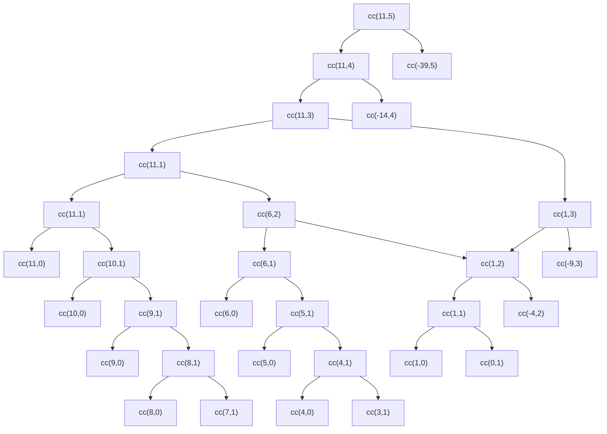

```mermaid
graph TD
  n0["cc(11,5)"] --> n1["cc(11,4)"]
  n0 --> n29["cc(-39,5)"]

  n1 --> n2["cc(11,3)"]
  n1 --> n28["cc(-14,4)"]

  n2 --> n3["cc(11,1)"]
  n2 --> n26["cc(1,3)"]

  n3 --> n4["cc(11,1)"]
  n3 --> n13["cc(6,2)"]

  n4 --> n5["cc(11,0)"]
  n4 --> n6["cc(10,1)"]

  n6 --> n7["cc(10,0)"]
  n6 --> n8["cc(9,1)"]

  n8 --> n9["cc(9,0)"]
  n8 --> n10["cc(8,1)"]

  n10 --> n11["cc(8,0)"]
  n10 --> n12["cc(7,1)"]

  n13 --> n14["cc(6,1)"]
  n13 --> n21["cc(1,2)"]

  n14 --> n15["cc(6,0)"]
  n14 --> n16["cc(5,1)"]

  n16 --> n17["cc(5,0)"]
  n16 --> n18["cc(4,1)"]

  n18 --> n19["cc(4,0)"]
  n18 --> n20["cc(3,1)"]

  n21 --> n22["cc(1,1)"]
  n21 --> n25["cc(-4,2)"]

  n22 --> n23["cc(1,0)"]
  n22 --> n24["cc(0,1)"]

  n26 --> n21
  n26 --> n27["cc(-9,3)"]
```
